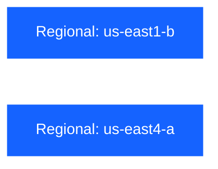

# Kryptos

 

## Purpose

Kryptos owns the platform secrets service. It deploys [OpenBao](https://openbao.org) as a Helm release in the `pt-kryptos-openbao` namespace on Pneuma-managed GKE clusters.

## Consumer contract

Kryptos consumes cluster runtime and connectivity from Pneuma and provides the foundation for approved OpenBao authentication, policy, and secret paths. It does not own GKE clusters, application deployment, or CI/CD workflows. Consumers must use platform-managed OpenBao identities and policies rather than storing static credentials in repositories or CI environments.

### 🛠️ Tools

- [pre-commit](https://github.com/pre-commit/pre-commit)
- [osinfra-pre-commit-hooks](https://github.com/osinfra-io/pt-techne-pre-commit-hooks)

### 📋 Skills and Knowledge

Links to documentation and other resources required to develop and iterate in this repository successfully.

- [google kubernetes engine](https://cloud.google.com/kubernetes-engine/docs)
- [helm](https://helm.sh/docs/)
- [kubernetes](https://kubernetes.io/docs/home/)
- [openbao](https://openbao.org/docs/)

## 🔄 Deployment Dependency Graph

Sandbox runs for pull requests, non-production runs after merges to `main`, and production runs after non-production succeeds. Each environment deploys the `us-east1-b` and `us-east4-a` regional workspaces in parallel.

