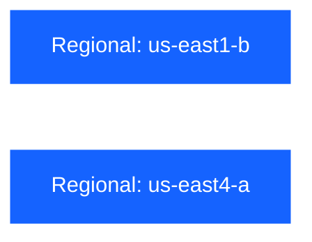

# Kryptos

 

## 📄 Repository Description

This repository contains the Infrastructure as Code (IaC) for the Kryptos domain — the hidden foundation of platform security. It manages secrets infrastructure by deploying and configuring [OpenBao](https://openbao.org) across GKE clusters in each deployment zone.

### 🛠️ Tools

- [pre-commit](https://github.com/pre-commit/pre-commit)
- [osinfra-pre-commit-hooks](https://github.com/osinfra-io/pt-techne-pre-commit-hooks)

### 📋 Skills and Knowledge

Links to documentation and other resources required to develop and iterate in this repository successfully.

- [google kubernetes engine](https://cloud.google.com/kubernetes-engine/docs)
- [helm](https://helm.sh/docs/)
- [kubernetes](https://kubernetes.io/docs/home/)
- [openbao](https://openbao.org/docs/)

## 🔄 Deployment Dependency Graph

Each workflow (sandbox, non-production, production) deploys two zone workspaces in parallel.

